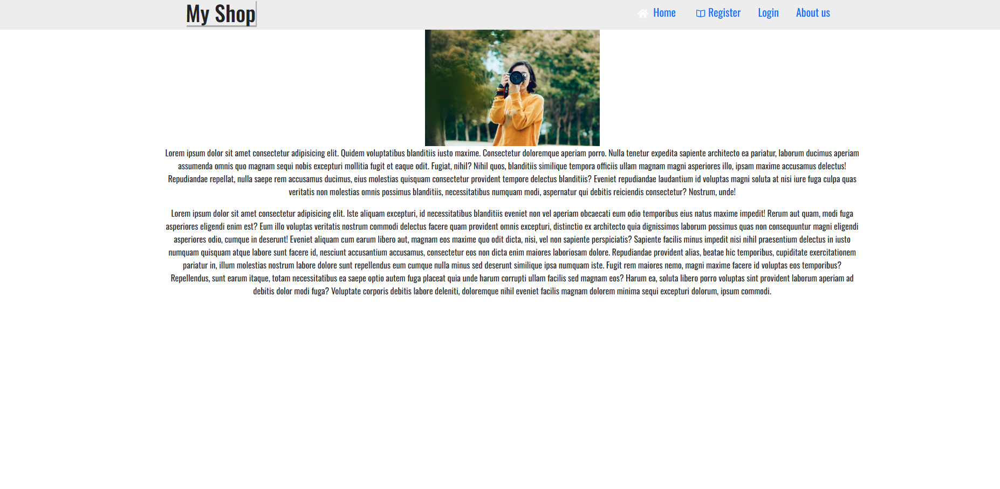

# Online Shopping Web

An eCommerce platform built with React (frontend) and Node.js/Express (backend), with MongoDB for data storage. The site features product browsing, user authentication, cart functionality, and checkout.

## Features
- **Frontend:** Built with ReactJS, dynamic product display, user authentication, and interactive UI.
- **Backend:** Node.js, Express, MongoDB for handling product data and user interactions.

## Installation

### Prerequisites
- Node.js
- MongoDB

### Frontend Setup
1. Navigate to the frontend directory:
    ```bash
    cd frontend
    ```
2. Install dependencies:
    ```bash
    npm install
    ```
3. Run the frontend:
    ```bash
    npm start
    ```

### Backend Setup
1. Navigate to the backend directory:
    ```bash
    cd backend
    ```
2. Install dependencies:
    ```bash
    npm install
    ```
3. Run the backend:
    ```bash
    npm start
    ```

## Usage
- Register and login to explore products.
- Add products to your cart and proceed to checkout.

## License
This project is licensed under the MIT License.

## Screenshot
The Home page:

The Products page:

The Cart page:

